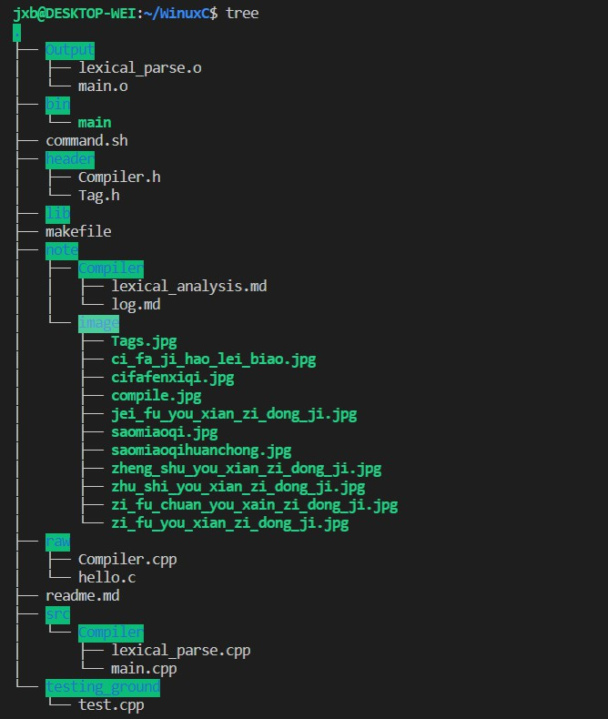

> 2019 - 11 -15 (周五)

今天尝试将.h 与 .cpp 文件分开
- 重新规划了目录，

- 配置了makefile文件

```
# makefile
# 描述： C++ 项目 makefile文件
# 版本： v3.0
# 修改记录:  1.先测试普通的cpp文件的编译运行
#		    2.使用变量来改进我们的makefile文件
#			3.新加了一个源文件
#			4.使用伪目标，加上clean规则
#			5.使用wildcard函数，自动扫描当前目录下的源文件
#			6.加入了自动规则依赖
#			7.改变依赖关系的生成模式
#			8.提供多目录文件编译

# 头文件存放目录
INC_DIR=./header

# 可执行文件存放目录
BIN_DIR=./bin

# 源文件存放目录
SRC_DIR=./src/Compiler

# 其它中间文件存放目录
OBJ_DIR=./Output

# 源文件列表
SRC	:= ${wildcard ${SRC_DIR}/*.cpp}

# obj文件列表
OBJ	:= ${patsubst %.cpp, $(OBJ_DIR)/%.o, ${notdir ${SRC}}}

# 定义编译命令变量
CC	:= g++
rm	:= rm -rf

# 定义可执行文件变量
executable	:= main
BIN_TARGET=${BIN_DIR}/${executable}

# 终极目标规则：生成可执行文件
${BIN_TARGET}:${OBJ}
	${CC} ${OBJ} -o $@

# 子目标规则：生成链接文件
${OBJ_DIR}/%.o:${SRC_DIR}/%.cpp
	${CC} -o $@ -c $< -I${INC_DIR}

#clean规则
#.PHONY: clean
#clean:
#清除编译生成的所有文件
##	$(RM) $(BIN_TARGET) $(OBJ_DIR)/*.o
#清除编译生成的所有文件,不包括可执行文件
#	$(RM) $(OBJ_DIR)/*.o

```
- code runner setting
```
"cpp": "cd $dir && cd .. && cd ..  && make",
```
- **问题**
gdb无法正常运行